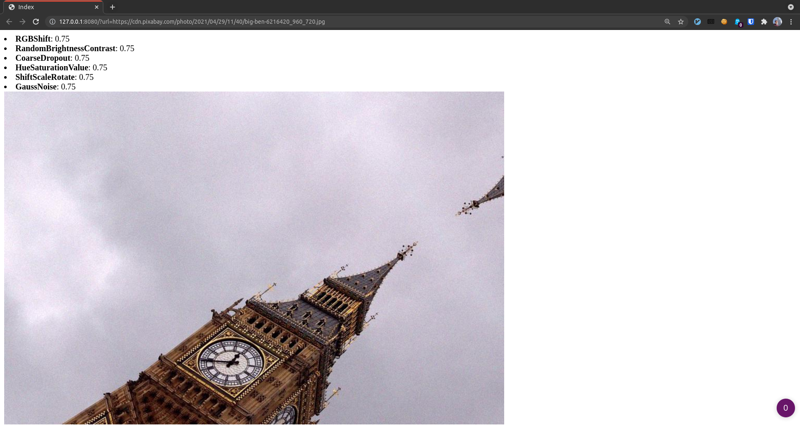

# Flask-server to explore augmentations

This package contains a Flask application to render image augmentations.

**Warning**: It is highly insecure and is NOT recommended to run in production.

## Features
- The package is organized as a proper Python package installable via `pip` (so that no hacks like `sys.append` or `export PYTHONPATH` are needed).
- Flask app uses `mymodel`'s augmentations as a proper python package.
- No logic has been changed except that we print the transformations and their probabilities together with the image.
- Many problematic places are highlighed with `TODO` (no parameters exposed, UX and security issues, etc.)
- To improve code quality, we implemented linters + auto-formatters (`black`, `flake`, `isort`) and type checker (`mypy`).
- Also, a basic test on Flask app added.
- As it was asked, we have put both python packages into a docker image that is built via GitHub Actions CI/CD.
- CI/CD runs on each Pull Requests to the `master` branch, as well as on each `master` commit
- CI runs linter and test checks for both packages.
- If CI checks passed, it then builds the image using [Dockerfile](../Dockerfile) are pushes it to DockerHub under the public repository [`artemlops/flask_augmentations`](https://hub.docker.com/r/artemlops/flask_augmentations).
- The tag of the image is 7 digits of the commit that triggered the build. Note: the `latest` image does NOT exist.

## Instructions
1. Setup your current workspace: `python -m venv venv && source ./venv/bin/activate && make setup`
2. Run linter checks: `make lint`
3. Run tests: `make test`
4. Once changed the code, auto-format it: `make format`
5. To build and push docker image: `make docker_build && make docker_push`
6. To run Flask locally: `make serve`
7. To run Flask in docker: `make docker_serve COMMIT=a11f7e6d` (7-digit of a commit SHA).
8. To stop the Flask in docker: `make docker_kill`

Once running a Flask app, test it:
- http://0.0.0.0:8080/?url=https://cdn.pixabay.com/photo/2021/04/29/11/40/big-ben-6216420_960_720.jpg
- http://0.0.0.0:8080/?url=https://cdn.pixabay.com/photo/2021/06/07/17/12/plant-6318497_960_720.jpg
- http://0.0.0.0:8080/?url=https://cdn.pixabay.com/photo/2021/06/01/06/24/old-town-6300696_960_720.jpg
- http://0.0.0.0:8080/?url=https://cdn.pixabay.com/photo/2021/06/07/14/21/mountains-6318080_960_720.jpg

## Known issues
- Some transforms handle black-white images incorrectly, thus throwing 500 error. Now Flask app works properly only for RGB images (see examples).
- Support multi-processing: now, only 1 user can work with the app at a single moment of time.
- Security: white-list domain names so that the server doesn't arbitrary requests to any host on the Internet,

## Ideas of improvements
- Better test coverage (integration tests, etc).
- Automatic deployment, if needed.
- Better UI (for example, allow the user to insert `url` into a text frame).
- Better flexibility: expose more start-up parameters (host, port, `n` for maximum number of transformations, etc).
